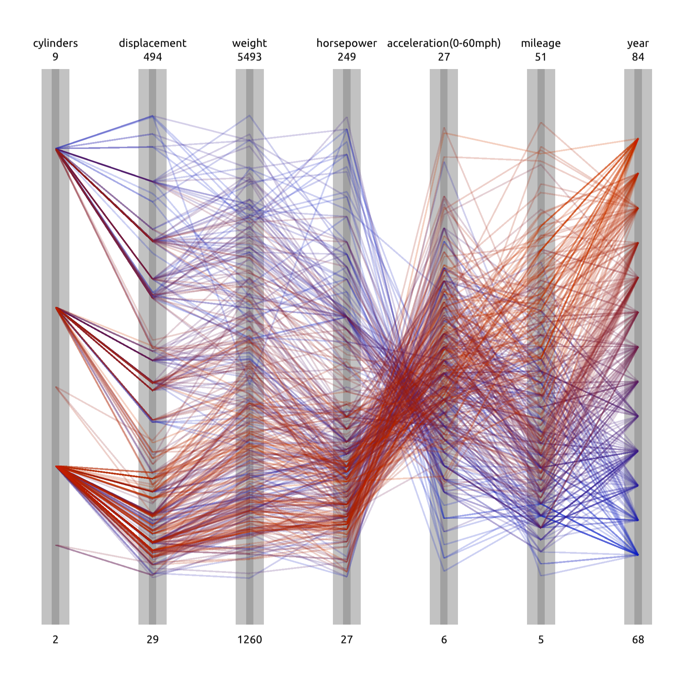

# Lab5 Report

## Parallel Coordinates Visualization

在这个任务中，我实现了Parallel Coordinates的可视化。先初始化画布的背景色，然后画出平行坐标中的方框和竖线，最后根据遍历每一个数据，画出对应的线即可完成。此外，为了实现方便，我还添加了一个函数`float data_i(Car c, int i)`，用于获取第i个平行坐标对应的数据。最终的结果如下图所示。
