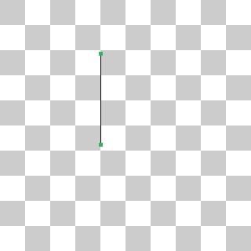
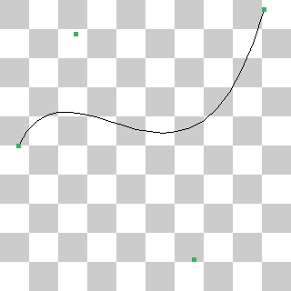

# Lab1 Report

## Task 1 Image Dithering

### Uniform Random

I use the function rand in this section to generate the random integers. I apply some tricks to transfer it to the random float in the interval [0,1]. 

```c++
float noise = rand() % (10000) / (float) (10000);
```

### Blue Noise Random

Just like the task previous, I use the blue noise provided by TA. 

### Ordered

I use the following strategy to upsample a pixel, i.e. when the grayscale is in the interval $[\frac{i}{10},\frac{i+1}{10})$, I use the ith grid to replace it.  


### Error Diffusion

In this case, we divide the error into 4 chunks and add the error chunks to the neighboring pixels. 

```c++
for (std::size_t y = 0; y < input.GetSizeY(); ++y){
	for (std::size_t x = 0; x < input.GetSizeX(); ++x){
          ***
     }
}
```

Note that unlike the tasks previous, in this case, the order of loops of x and y can’t be reversed. This is because we need to allocate the error to the pixel unprocessed. 

I use the strategy Mr. Chen mentioned in the class to allocate the error.

### Outcomes

<center class="half">


</center>
## Task 2: Image Filtering

### Blur

I use a $3\times 3$ kernel filled with $\frac{1}{9}$ to do convolution. To simplify the implementation, I copy the image to a buffer and pend it with a layer of 0. 

### Edge

I use two kernels to calculate $\frac{\part F}{\part x}$ and $\frac{\part F}{\part y}$. 
$$
Kernel\ 1: \ \ \ &1 & 2 & 1& \ \ \ \ \  \ \ \ \ \ \ \  \ \ Kernel\ 2:\ \ \  &1 & 0 & -1\\
&0 & 0 & 0& \ \ \ \ \  \ \ \ \ \ \ \  \ \  &2 & 0 & -2\\
&-1 & -2 & -1& \ \ \ \ \  \ \ \ \ \ \ \  \ &1 & 0 & -1 \\
$$
In the implementation, pend the image with 0 as the above. 

### Outcome

<center class="half">


</center>

## Task 3: Image Inpainting

I use the Poisson Editing Algorithm to solve this task. First, I calculate the edge which is the same as the background image. 

Take the vertical edge as the example.

```C++
 for (std::size_t y = 0; y < height; ++y) {
   glm::vec3 color1 = inputBack[{ (std::size_t)(offset[0]), (std::size_t)(offset[1] + y) }];
   g[y * width]  = color1;
   glm::vec3 color2 = inputBack[{ (std::size_t)(offset[0] + width - 1), (std::size_t)(offset[1] + y) }];
   g[y * width + width - 1] = color2;
}
```

Then I use Jacobi Iteration Algorithm to solve it. We need to calculate $b$, in this case which is $|\nabla\textit{g}|=\Delta Img\_front$.  

```C++
glm::vec3 div_front = inputFront[{ x + 1, y }] \ 
     + inputFront[{ x - 1, y }] + inputFront[{ x, y + 1 }] + inputFront[{ x, y - 1 }]; 
div_front = div_front - inputFront[{ x, y }] * glm::vec3(4); 
```

Then we use Jacobi Iterarion.

```C++
g[y * width + x] = (g[(y - 1) * width + x] \ 
     + g[(y + 1) * width + x] + g[y * width + x - 1] + g[y * width + x + 1]);
g[y * width + x]    = (g[y * width + x] - div_front) * glm::vec3(0.25);
```

The following is the outcome. 


## Task 4: Draw Line

I use the Bresenham’s line algorithm to draw lines. First, I divide this task into 2 cases by slope. The two cases are similar, so I will demonstrate one case that slope < 1.

```c++
switch (abs(p0[0] - p1[0]) >= abs(p0[1] - p1[1])) // slope > 1 ?
```

In each case, I set p0 the start point, and I only draw a line toward right. If the positions of p0 and p1 don’t satisfy the condition, I swap them. 

```c++
if (p0[0] > p1[0]) {
	ponits[0] = p1;
	ponits[1] = p0;
} else {
	ponits[1] = p1;
	ponits[0] = p0;
	}
```

Different from the template in the slides, I set the direction by $sg$. 

```C++
sg = (ponits[1][0] - ponits[0][0]) / abs(ponits[1][0] - ponits[0][0]);
dx = 2 * abs(ponits[1][0] - ponits[0][0]), dy = 2 * (ponits[1][1] - ponits[0][1]);
```

When we need to modify y, we add $sg$ instead of  1. The following images are the outcome.

<center class="half">


</center>

<center class="half">



</center>

## Task 5: Triangle Drawing

First, I sort three points by the coordinator of y and store them into $P[3]$. Then I divide the task into 2 similar parts. I divide the triangle to two parts by the line $y=P[1].y$, and each part is a new triangle with one edge parallel to x axis. I take the first part as an example to demonstrate. For each y, I caculate the left and right boundaries x1, x2 and draw a line. 

```c++
for (int y = P[1][1]; y < P[0][1]; y++) {
	int x1 = round(1.0 * ((y - P[1][1]) * (P[0][0] - P[1][0])) / (P[0][1] - P[1][1])) + P[1][0];
		int x2 = round(1.0 * (y - P[2][1]) * (P[0][0] - P[2][0]) / (P[0][1] - P[2][1])) + P[2][0];
          if (x1 > x2) {
			int tmp = x1;
               x1      = x2;
               x2      = tmp;
           }
           for (int x = x1; x <= x2; x++) {
               canvas.SetAt({ (std::size_t) x, (std::size_t) y }, color);
           }
	}
```

And the we draw the vertex. 

Note that we need to consider the special case that the triangle has an edge parallel to x axis. I have to draw an edge.

## Task 6: Image Supersampling

In this task, I implemented the SSAA algorithm. I divided this task into two parts, super sampling from the origin image and down sampling. When super sampling, I use double linear interplotation algorithm. When down sampling, I just average the grid of $rate*rate$ pixels to get the corresponding pixel. The following image show the effect of SSAA. 

<center class="half">


</center>

<center class="half">


</center>

## Task 7: Bezier Curve

In this task, I use recursive function to implement it. Each time I find the corresponding points set with the size reduced util the size is 1. I can directly return the only point if the size is 1. 

```C++
glm::vec2 CalculateBezierPoint(
        std::span<glm::vec2> points,
        float const          t) {
        // your code here:
        std::vector<glm::vec2> p;
        for (int i = 0; i < points.size() - 1; i++) {
            p.push_back(points[i]);
            p[i][0] = (1 - t) * points[i][0] + t * points[i][0];
            p[i][1] = (1 - t) * points[i][1] + t * points[i][1];
        }
        if (points.size() == 2) {
            return p[0];
        } else {
            std::span<glm::vec2> tmp(p);
            return CalculateBezierPoint(tmp, t);
        }
    }
```

 The following is results.

<center class="half">



</center>
